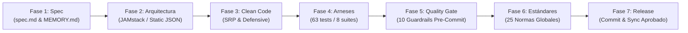

# Guía Técnica de Metodología Spec-Driven Development (SDD), Arneses de Calidad y Estándares Internacionales

**Playbook de Arquitectura, Automatización y Buenas Prácticas para Proyectos Web Enterprise y Gubernamentales**  
**Proyecto de Referencia:** Repositorio Institucional de Planeamientos Curriculares  
**Institución:** Dirección de Desarrollo Curricular (DDC) · Ministerio de Educación Pública de Costa Rica  
**Autores:** Ing. Cristian Vargas & Antigravity (Pair Programming)  
**Versión:** 1.0.1 (Octubre 2026)  
**Formato PDF:** Disponible en [`documentacion/Guia-Tecnica-Metodologia-SDD-Arneses-DDC.pdf`](file:///c:/xampp/htdocs/ddc-planes-digitales/documentacion/Guia-Tecnica-Metodologia-SDD-Arneses-DDC.pdf)

---

## 1. ¿Qué es Spec-Driven Development (SDD)? (Explicado para Principiantes y Expertos)

En el desarrollo tradicional de software (*Code-First*), los programadores suelen abrir el editor y comenzar a escribir código inmediatamente según lo que recuerdan de una reunión o un chat. Conforme la aplicación crece, surgen inconsistencias en los nombres, rutas rotas, fallos de renderizado y desacuerdos sobre cómo debía funcionar una pantalla.

> **La Analogía del Arquitecto:** Nadie construye un edificio de 20 pisos colocando ladrillos y viendo sobre la marcha dónde poner las puertas. Primero se dibujan los planos estructurales (la especificación). Una vez que los planos están aprobados por ingeniería, los constructores pegan los ladrillos siguiendo fielmente el plano. Si una pared no coincide con el plano, se corrige de inmediato.

**Spec-Driven Development (SDD)** traslada esta misma disciplina a la ingeniería de software:
1. **El Contrato es Primero:** Antes de tocar el código de React o de la API, se redacta el documento de especificación técnica formal (`spec.md`) y el protocolo de calidad (`quality-gates.md`).
2. **Única Fuente de Verdad (Single Source of Truth - SSOT):** Todo el equipo (humanos y asistentes de IA) consulta el mismo archivo central de especificación. No hay ambigüedades.
3. **El Código Existe para Satisfacer la Spec:** El código no inventa reglas; su único trabajo es cumplir la especificación al 100%.
4. **Los Tests Verifican el Cumplimiento:** Las pruebas automatizadas leen la especificación y confirman matemáticamente que el sistema la cumple a cabalidad antes de cada commit.

---

## 2. El Procedimiento Paso a Paso (El Algoritmo para Futuros Proyectos)

Para replicar el éxito de este proyecto en futuras iniciativas del MEP o del sector público/privado, se debe seguir estrictamente este flujo de 7 fases:



### Detalle de Ejecución de las Fases:
1. **Fase 1 — Creación del SSOT en `docs/`:** Crear los archivos `spec.md` (alcance funcional, filtros, reglas de negocio), `MEMORY.md` (decisiones arquitectónicas y su porqué) y `quality-gates.md` (límites de compilación, umbrales de tamaño y guardrails).
2. **Fase 2 — Diseño de Arquitectura 100% Estática (JAMstack):** Eliminar dependencias de lenguajes de servidor en tiempo de ejecución (como scripts PHP lentos o procesos pesados de Node). Diseñar el catálogo maestro como un archivo JSON estructurado (`ddc-planeamientos.json`) que el navegador consulte mediante `fetch()` con parámetros de *cache-busting* (`?_t=[timestamp]`).
3. **Fase 3 — Implementación Modular Limpia (Clean Code):** Desarrollar componentes pequeños con una sola responsabilidad (SRP). Aplicar programación defensiva con operadores de encadenamiento opcional (`?.`) y coalescencia nula (`??`) para que ningún valor inesperado rompa la vista.
4. **Fase 4 — Construcción de los Arneses de Pruebas:** Construir pruebas unitarias, de paginación, pruebas responsive multiresolución, pruebas de caos (red caída) y pruebas sensoriales de accesibilidad (Ley 7600 y WCAG).
5. **Fase 5 — Configuración del Pre-Commit Hook:** Instalar un script en `.git/hooks/pre-commit` que ejecute automáticamente los guardrails y los tests antes de permitir cualquier commit. Si una prueba falla, el commit se aborta.
6. **Fase 6 — Auditoría de Estándares Internacionales:** Validar accesibilidad, semántica HTML5, seguridad OWASP y compatibilidad multiplataforma.
7. **Fase 7 — Autorización Explícita y Sincronización:** Revisión por el programador senior y ejecución manual del `git push`.

---

## 3. Mapa y Catálogo de Archivos del Proyecto (Estructura y Función)

| Archivo / Ruta | Categoría | Propósito y Función Técnica |
| :--- | :--- | :--- |
| `app/src/App.jsx` | Componente UI | Orquestador raíz de la interfaz. Maneja el estado global del catálogo, filtros, modales, modo claro/oscuro persistente, y aloja el *Skip Link* accesible para WCAG 2.4.1. |
| `app/src/main.jsx` | Punto de Entrada | Inicializa el DOM de React 19 y envuelve la aplicación completa dentro del contenedor `ErrorBoundary`. |
| `app/src/components/GeneralTable.jsx` | Componente UI | Sección principal: catálogo oficial. Integra la barra de búsqueda rápida, selector de filas por página, filtros emergentes por columna (Popovers) y la tabla con paginación matemática. |
| `app/src/components/TopDownloads.jsx` | Componente UI | Muestra los planeamientos más populares descargados por los docentes en tiempo real con barras de progreso y cálculo porcentual. |
| `app/src/components/WelcomeHero.jsx` | Componente UI | Banner institucional con degradado azul MEP, título H1 institucional limpio y descripción normativa de la DDC. |
| `app/src/components/Header.jsx` | Componente UI | Barra superior institucional fija. Contiene logotipos del MEP, contadores globales de planes y descargas, botón de tema claro/oscuro y acceso al modal Acerca de. |
| `app/src/components/Footer.jsx` | Componente UI | Pie de página fijo con badges dinámicos del sistema, enlace normativo de la DDC y badge verde con la vigencia lectiva oficial. |
| `app/src/components/SplashScreen.jsx` | Componente UI | Pantalla de carga inicial institucional. Se muestra mientras el navegador descarga el JSON del catálogo. Maneja contingencia y botón de reintento si no hay red. |
| `app/src/components/ErrorBoundary.jsx` | Seguridad UI | Componente de captura de excepciones no controladas de React 19. Evita pantallas blancas y muestra una tarjeta institucional con botón de recarga. |
| `app/src/components/AboutModal.jsx` | Componente UI | Modal institucional que detalla la cobertura curricular de los 197 planes, las 7 ofertas educativas y la versión de compilación. |
| `app/src/components/ResetConfirmModal.jsx` | Componente UI | Modal de confirmación para restablecer contadores de descargas a cero (mantenimiento docente). Soporta cierre con la tecla Escape. |
| `app/src/components/Icons.jsx` | Activos UI | 15 iconos SVG nativos optimizados, sin dependencias pesadas de librerías externas de iconos. |
| `app/src/data/planes2027Data.js` | Capa de Datos | Módulo desacoplado de consulta HTTP al catálogo mediante `fetch()` con cache-busting, y persistencia ligera de descargas en `localStorage`. |
| `app/src/data/version.json` | Configuración | Fuente única de verdad de la versión de la aplicación, título del Hero y badge de vigencia curricular. |
| `app/public/data/ddc-planeamientos.json` | Catálogo Maestro | Micro-API estática con los 197 registros curriculares normados, rutas web relativas y metadatos de archivos. |
| `app/public/ddc-planeamientos/` | Archivos Físicos | Estructura física de carpetas y 197 archivos comprimidos ZIP en estricto formato POSIX kebab-case. |
| `app/index.html` | Web Host | Página HTML5 con metadatos W3C, accesibilidad, color temático institucional y tarjetas Open Graph / Twitter para Teams y WhatsApp. |
| `app/docs/spec.md` | Documentación SDD | Especificación formal completa del sistema, contratos funcionales y casos de uso normados. |
| `app/docs/MEMORY.md` | Documentación SDD | Registro histórico y bitácora de todas las decisiones arquitectónicas tomadas y sus justificaciones técnicas. |
| `app/docs/quality-gates.md` | Documentación SDD | Protocolo de las 3 Puertas de Calidad pre-commit y definición de los umbrales de aceptación del software. |

---

## 4. El Universo de los Arneses de Pruebas (Test Harnesses)

Un **arnés de pruebas** es como la estructura de pruebas donde los ingenieros automotrices estrellan un vehículo contra un muro a 100 km/h para verificar que las bolsas de aire se abran. En software, el arnés somete al código a condiciones extremas para garantizar que nunca falle en manos de los usuarios finales.

En este proyecto implementamos **8 suites automatizadas con 63 pruebas en Vitest**:

1. **Arnés Unitario y de Capa de Datos (`planes2027Data.test.js` - 7 tests):**
   - Valida la consulta asíncrona a `ddc-planeamientos.json`.
   - Garantiza que la persistencia de descargas en `localStorage` no sobreescriba ni mute los datos remotos.
   - Comprueba la función de restablecimiento de prueba (reset a cero).

2. **Arnés de Paginación Matemática (`GeneralTable.test.jsx` - 5 tests):**
   - Algoritmo de ventana deslizante: garantiza que en tablas con 197 registros nunca se generen botones de página duplicados ni claves DOM repetidas (`key` única).
   - Prueba combinaciones de filtros de búsqueda cruzados (texto libre + ofertas + asignaturas).

3. **Arnés de Splash Screen (`SplashScreen.test.jsx` - 3 tests):**
   - Ciclo de vida del spinner de carga institucional.
   - Presentación de mensajes de error amigables ante fallas de conexión y botón interactivo de reintento.

4. **Arnés de Guardrails Físicos y de Disco (`guardrails.test.js` - 10 tests):**
   - Cero Mojibake UTF-8 (Strict No-BOM).
   - Paridad bidireccional 1:1 entre disco duro y catálogo JSON.
   - Verificación de formato estricto POSIX kebab-case en 241 carpetas y 197 archivos ZIP.

5. **Arnés Responsive Multi-Viewport (`responsive.test.jsx` - 20 tests):**
   - Simula 20 pantallas comerciales del mundo real: móviles pequeños (320px, 360px, 375px), tablets (768px, 800px, 820px), laptops (1366px, 1440px), escritorios (1080p) y monitores 4K UHD (3840px).

6. **Arnés de Caos y Resiliencia Extrema (`chaos.test.jsx` - 8 tests):**
   - Simula desastres reales: red completamente caída (Offline), servidores devolviendo HTTP 500 y 502, JSON corrupto con comas sobrantes, ráfagas de 50 clics simultáneos y cuota de almacenamiento llena (`QuotaExceededError`).

7. **Arnés Sensorial y Accesibilidad (`sensory.test.jsx` - 8 tests):**
   - Cumplimiento de la Ley 7600 de Costa Rica y W3C WCAG 2.1 AA: etiquetas `aria-label` en todos los botones, contraste de color superior a 4.5:1, navegación completa por teclado y el *Skip Link* accesible (`WCAG 2.4.1`).

8. **Arnés de Tolerancia a Excepciones UI (`ErrorBoundary.test.jsx` - 2 tests):**
   - Lanza excepciones imprevistas en componentes React para comprobar que el `ErrorBoundary` atrapa el error y ofrece contingencia institucional sin pantalla blanca.

---

## 5. El Sistema de Guardrails Pre-Commit (Las 3 Puertas de Calidad)

Para que ningún desarrollador cometa errores por descuido o fatiga, el sistema implementa un **Quality Gate automatizado** que bloquea la ejecución de `git commit` si no se superan las 3 puertas:

```
[git commit] ──▶ Puerta 1: Guardrails ──▶ Puerta 2: Tests (63) ──▶ Puerta 3: Build (<300KB) ──▶ [Commit OK]
```

### Los 10 Guardrails de Seguridad y Disco:
1. **TEST-18: Cero Mojibake UTF-8 (Strict No-BOM):** Escanea todo el código fuente y catálogos en busca de bytes invisibles BOM o caracteres corruptos (`á`, `é`).
2. **TEST-19: Cero Rutas Físicas de Windows:** Rechaza cualquier registro en el JSON que contenga rutas tipo `C:\xampp\...`.
3. **TEST-20: Desacoplamiento del Bundle:** Prohíbe que el archivo de datos JSON sea importado directamente en el JavaScript de React, forzando la carga asíncrona por red.
4. **TEST-21: Lenguaje Institucional Formal:** Verifica que en la interfaz no se utilicen tratamientos informales («tú» o «vos»), exigiendo el tratamiento costarricense formal institucional («usted»).
5. **TEST-22: Nombres Web Seguros (Cero Puntos y Cero Espacios):** Garantiza que ninguna ruta web contenga puntos o espacios que rompan servidores web Linux o Nginx.
6. **TEST-23: Cero Prefijos Numéricos en Textos de Interfaz:** Asegura que los nombres de asignaturas se muestren limpios a los docentes (ej: "Español", no "4. Español").
7. **TEST-24: Verificación Física al 100% de los 197 ZIPs:** Comprueba en el disco duro que cada uno de los 197 archivos existe físicamente y no está vacío.
8. **TEST-28: Guardrail de Directorios Kebab-Case:** Exige que las 241 carpetas en disco estén en minúsculas y separadas exclusivamente por guiones medios (POSIX kebab-case).
9. **TEST-29: Guardrail de Archivos ZIP Kebab-Case:** Exige que los 197 archivos ZIP cumplan la misma regla estricta sin espacios ni caracteres especiales.
10. **TEST-30: Paridad Bidireccional 1:1:** Comprueba matemáticamente que no exista ni un solo archivo huérfano en disco sin registrar en el JSON, ni ningún registro en el JSON sin archivo físico.

---

## 6. Matriz de los 25 Estándares Internacionales Cumplidos

| # | Estándar Internacional | Organismo Rector | Aplicación Práctica en la Solución DDC |
| :---: | :--- | :--- | :--- |
| **01** | **Twelve-Factor App (III - Config)** | Cloud-Native Standards | Separación total de configuración y código en `version.json` y `ddc-planeamientos.json`. Cero constantes quemadas. |
| **02** | **JAMstack Architecture** | Modern Web Principles | Arquitectura 100% estática desacoplada. Cero motores lentos en servidor (PHP/Node); micro-API estática mediante `fetch()`. |
| **03** | **App Shell Pattern** | W3C / Google PWA | Estructura visual estricta de 100vh con Header y Footer fijos y scroll único en el viewport central. |
| **04** | **ISO/IEC 25010 (Portability)** | ISO / IEC | Independencia total de plataforma y sistema operativo. 100% rutas relativas funcionales en Linux, Apache, Nginx, Azure o AWS. |
| **05** | **IETF RFC 3986** | IETF (Internet Standard) | Sintaxis uniforme de URIs en minúsculas kebab-case (`^[a-z0-9]+(-[a-z0-9]+)*$`), sin espacios ni diacríticos. |
| **06** | **IETF RFC 8259** | IETF (JSON Standard) | Intercambio de datos JSON con validación defensiva en el cliente y rechazo inmediato de cargas corruptas o no tabulares. |
| **07** | **Unicode RFC 3629** | Unicode Consortium | Codificación UTF-8 estricta sin marcas de orden de bytes (BOM) para garantizar inmunidad total contra caracteres corruptos. |
| **08** | **IETF RFC 7234** | IETF (HTTP Protocol) | Directivas de invalidación de caché (`cache: 'no-cache'` y parámetro `?_t=[timestamp]`) para actualizaciones inmediatas. |
| **09** | **W3C HTML5 Recommendation** | W3C | Uso de etiquetas semánticas nativas: `<header>`, `<main>`, `<footer>`, `<section>`, `<button>`. |
| **10** | **SOLID - SRP** | Robert C. Martin | Principio de Responsabilidad Única: separación rigurosa entre vistas, lógica de persistencia, iconografía y filtros. |
| **11** | **Defensive Programming** | SEI / Carnegie Mellon | Uso sistemático de encadenamiento opcional (`?.`) y operadores de coalescencia nula (`??`) contra excepciones de nulos. |
| **12** | **State Immutability Pattern** | React Core Standards | Estado borrador (Draft State) en menús de filtrado: congela la tabla y evita re-renders innecesarios hasta presionar Aplicar. |
| **13** | **Deterministic Algorithms** | IEEE Computer Society | Paginación matemática basada en ventanas deslizantes estrictas con claves DOM únicas que impiden duplicados. |
| **14** | **W3C WCAG 2.1 AA (1.1.1)** | W3C WAI / Ley 7600 CR | Alternativas textuales accesibles: 100% de los botones e iconos cuentan con `aria-label` o `title` descriptivo. |
| **15** | **W3C WCAG 2.1 AA (1.4.3)** | W3C WAI | Contraste cromático estricto superior a 4.5:1 en texto regular y 3:1 en títulos grandes en modo claro y modo oscuro. |
| **16** | **W3C WCAG 2.1 AA (2.1.1)** | W3C WAI | Operabilidad completa mediante teclado: tabulación fluida y anillos de foco visibles (`focus:ring-2`). |
| **17** | **W3C WCAG 2.1 AA (2.4.1)** | W3C WAI | Implementación de *Skip Link* al inicio del documento para saltar directamente al catálogo curricular con la tecla Tab. |
| **18** | **WAI-ARIA Dialog Pattern 1.2** | W3C WAI | Modales accesibles con atributo `role="dialog"`, `aria-modal="true"` y cierre automático al presionar Escape. |
| **19** | **Unicode CLDR / i18n** | Unicode Consortium | Ordenamiento alfabético sensible al idioma español mediante `localeCompare(..., 'es')` respetando diacríticos de la RAE. |
| **20** | **Google Core Web Vitals (LCP)** | Google Web Team | Largest Contentful Paint óptimo gracias al Splash Screen inmediato y a un bundle comprimido de apenas 83 KB en gzip. |
| **21** | **Google Core Web Vitals (CLS)** | Google Web Team | Cumulative Layout Shift de cero absoluto: alturas mínimas reservadas (`min-h-[480px]`) que previenen brincos de pantalla. |
| **22** | **Google Core Web Vitals (INP)** | Google Web Team | Interaction to Next Paint ultra reactivo: búsqueda predictiva instantánea y descargas escalonadas a 350ms sin congelar la UI. |
| **23** | **OWASP Client-Side Security** | OWASP Foundation | Almacenamiento seguro en `localStorage` limitado a un mapa de contadores numéricos; cero tokens o scripts expuestos. |
| **24** | **Web Storage Quota Defense** | W3C Web Storage | Captura preventiva de la excepción `QuotaExceededError` para garantizar que la app siga funcionando en memoria ante discos llenos. |
| **25** | **OWASP A03 (XSS Mitigation)** | OWASP Foundation | Cero uso de `dangerouslySetInnerHTML`; React escapa nativamente cualquier inyección maliciosa de código HTML/JS. |

---

## 7. Checklist para el Próximo Proyecto (El Template de Arranque de Ing. Cristian Vargas)

1. **Paso 1: Definir la Memoria y la Especificación (Día 1):** Crear la carpeta `docs/` y redactar `spec.md` (alcance funcional) y `MEMORY.md` (decisiones arquitectónicas).
2. **Paso 2: Establecer la Fuente Única de Verdad (SSOT):** Centralizar textos, versiones y títulos en archivos JSON desacoplados (como `version.json`), nunca quemados en el código.
3. **Paso 3: Instalar el Arnés de Pruebas Multi-Capa:** Configurar Vitest con Testing Library y crear suites para: 1) Capa de datos, 2) Responsive en 20 resoluciones, 3) Caos/Red, 4) Accesibilidad WCAG, y 5) Guardrails de disco.
4. **Paso 4: Blindar el Repositorio con el Pre-Commit Hook:** Configurar el Quality Gate en `.git/hooks/pre-commit` para obligar la ejecución limpia de guardrails, tests y compilación antes de cada commit.
5. **Paso 5: Respetar la Regla de Control de Versiones:** Trabajar en ramas locales, validar el 100% de pruebas en verde, generar la compilación de producción (< 300 KB) y sincronizar a GitHub únicamente con aprobación expresa.
